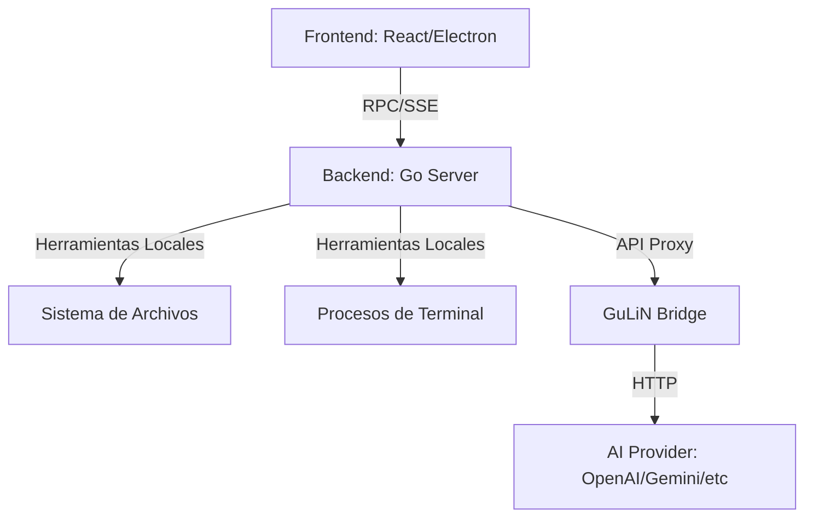

# Arquitectura del Sistema: GuLiN Agent

GuLiN Agent utiliza una arquitectura híbrida que separa la interfaz de usuario, la lógica de servidor local y el procesamiento de IA. Esta separación garantiza la rapidez de respuesta y la capacidad de ejecutar comandos locales mientras se interactúa con modelos de lenguaje.

## Componentes Principales

1.  **Frontend (Electron + React)**:
    - Proporciona la interfaz de usuario estilo terminal enriquecida.
    - Se comunica con el servidor local a través de llamadas RPC y suscripciones SSE (Server-Sent Events).
    - Renderiza las respuestas de la IA, herramientas y terminales.

2.  **Servidor Backend (Go)**:
    - Es el núcleo de la aplicación. Gestiona el sistema de archivos local, los procesos de terminal y la persitencia de datos.
    - Implementa el protocolo RPC para comandos inmediatos y el orquestador de chat.
    - Maneja la orquestación de herramientas ejecutadas localmente (leer archivos, ejecutar scripts).

3.  **GuLiN Bridge**:
    - Un microservicio especializado que actúa como intermediario con proveedores de LLM (OpenAI, Anthropic, Gemini, DeepSeek).
    - Garantiza la seguridad de las API keys y la gestión de modelos.

## Modelo de Interacción

- **Comandos RPC**: Acciones inmediatas como "crear terminal", "listar archivos" o "guardar configuración".
- **Chat SSE**: El flujo de conversación con el agente se realiza mediante streaming. El servidor Go recibe los chunks de la IA y los retransmite al frontend en tiempo real.
- **Tool Orchestration**: Cuando la IA solicita usar una herramienta (por ejemplo, `read_file`), el servidor local ejecuta la acción y devuelve el resultado a la conversación sin intervención manual del usuario.

## Diagrama de Flujo

## Ventajas de la Arquitectura
- **Latencia Mínima**: El acceso al sistema de archivos y terminal es directo y local.
- **Escalabilidad**: El Bridge puede manejar múltiples modelos sin sobrecargar el servidor principal.
- **Persistencia**: La base de datos local (`sqlite` / `filestore`) mantiene el historial de sesiones de manera privada.
